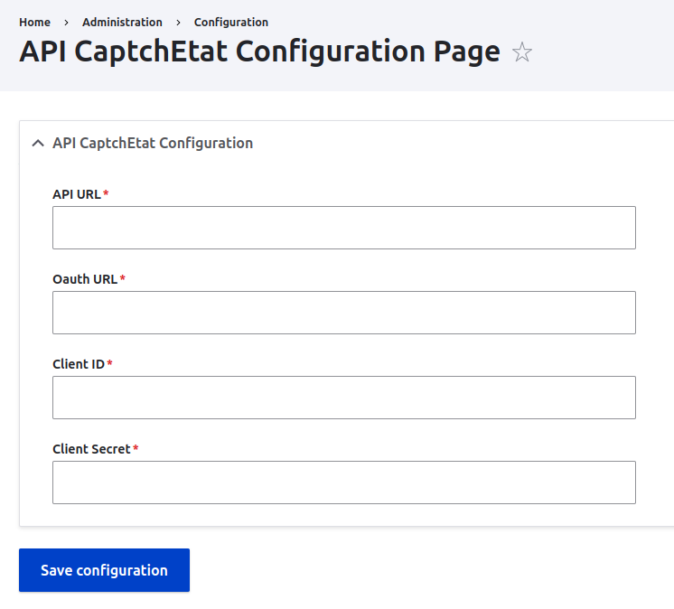
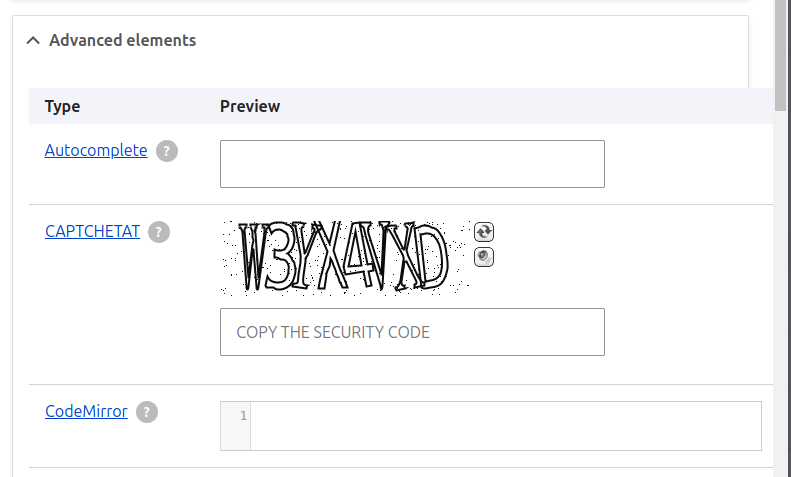

# CAPTCHETAT

This feature enables the integration of a CAPTCHA webform element
by connecting to the CaptchEtat API. This CAPTCHA webform element
enhances security measures by verifying that the user is human,
thereby preventing automated bots from submitting forms or
accessing certain functionalities.

For a full description of the module, visit the
[project page](https://www.drupal.org/project/captchetat)

Submit bug reports and feature suggestions, or track changes in the
[issue queue](https://www.drupal.org/project/issues/captchetat)

For more information about API Captchetat, visit 
[API CaptchEtat](https://api.gouv.fr/les-api/api-captchetat) 


## Table of contents

- Requirements
- Configuration
- Development
- Maintainers


## Requirements

This module relies on both the Webform module and Drupal core.


## Configuration

The configuration page is at `admin/config/captchetat/settings`,
where you can configure the CAPTCHETAT module.

1. Navigate to Administration > Extend and enable the module.
2. Proceed to Administration > Configuration > CAPTCHETAT
   to access the configuration page.
   
   
   
4. On the configuration page, enter the required API keys and URLs: [API CaptchEtat](https://api.gouv.fr/les-api/api-captchetat)
    - API URL
    - Oauth URL
    - Client ID
    - Client Secret 
5. Save configuration.


## Development

You can simply add the CAPTCHETAT element to your webforms like other fields.

### Adding CAPTCHETAT to webform


You can disable captchetat validation in your local or test environment by adding the
following line to `settings.php`:
```
$settings['disable_captchetat'] = TRUE;
```


## Maintainers

- Elia Wehbe - [ewehbe](https://www.drupal.org/u/ewehbe)
- Lara Zaki - [lara_z](https://www.drupal.org/u/lara_z)
- Georges ADWAN - [georges-adwan](https://www.drupal.org/u/georges-adwan)

## Supporting organizations:

- [bluedrop.fr](https://www.bluedrop.fr/) - ebizproduction - [bluedrop.fr - ebizproduction](https://www.drupal.org/bluedropfr-ebizproduction)
